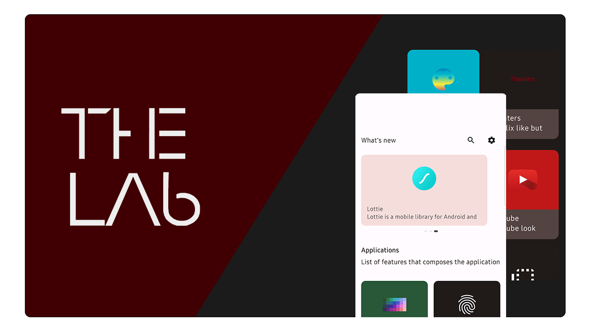
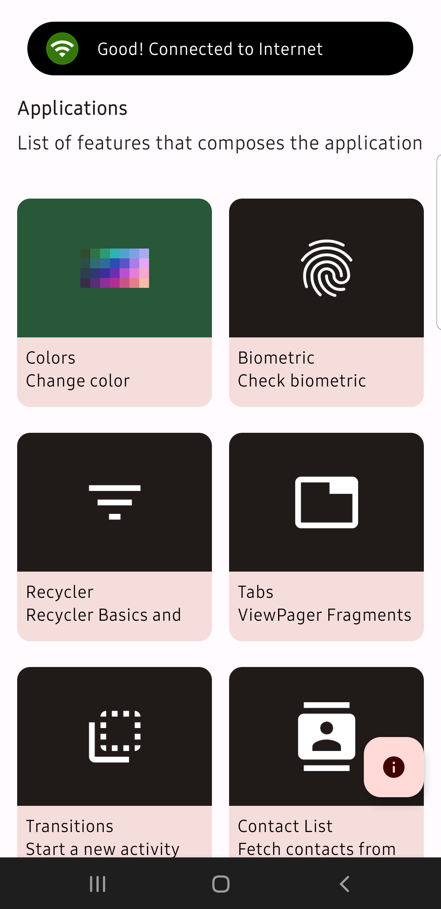
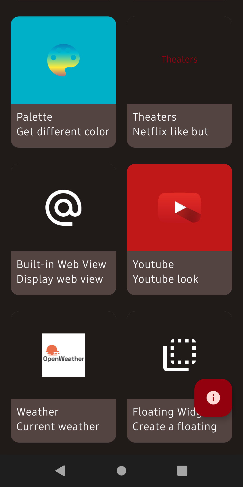
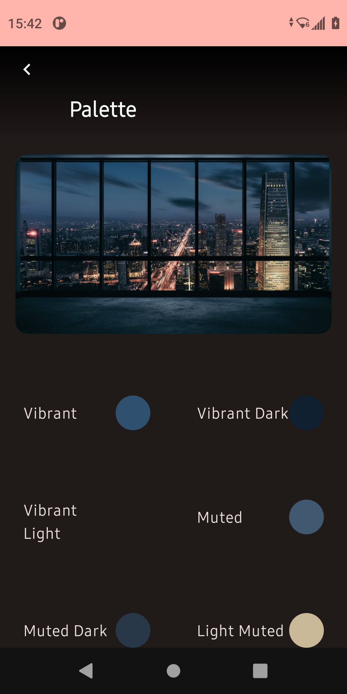
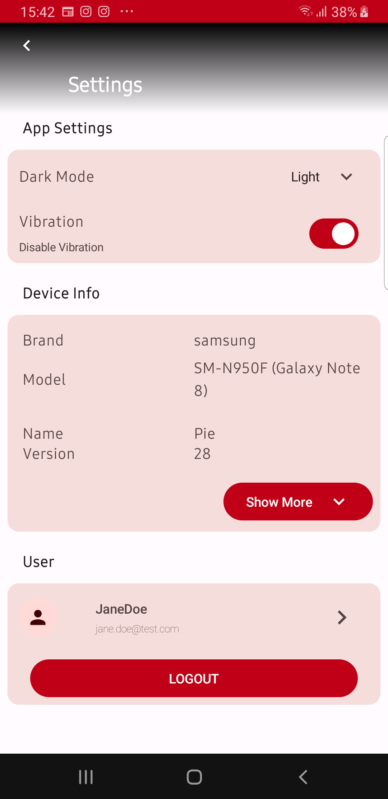
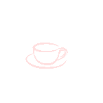

[![Kotools Types][kotools-types-badge]][kotools-types-project]
[![Kotlin][kotlin-badge]][kotlin]
[![kotlinx.serialization][kotlinx.serialization-badge]][kotlinx.serialization]

TheLab is the third version of ***Material Design***, an *Android* application originally developed
to show several use-cases of Google's Android Material Design components such as (CardView,
RecyclerView, so on and so forth), it's implementing the new Jetpack Compose.

It turns out to a "Lab App", where multiples libraries and use-cases are developed and tested in
this app (biometric section, speech-to-text, floating widgets, file downloading, notifications and more)

## Libraries

TheLab uses multiple libraries for UI as much as for network, image loading, dependency injection,
serialization and so on

- [AndroidX Jetpack Compose][jetpack-compose]
- [Coil][coil]
- [Lottie][lottie]
- [Media and Exoplayer][exoplayer]
- [Google APIs][google-apis]
- [Hilt][dagger-hilt]
- [Kotlin Serialization][kotlinx-serialization]
- [Retrofit][retrofit]
- [OkHttp][okhttp]
- [Timber][timber]

## Migrations

TheLab was originally using XML layouts and view bindings. Currently we are migrating all the layouts to Jetpack Compose. Here's a few examples

***Home***

***Home with dark mode***

***Palette***

***Settings***

## Versioning

This repository use *Git* as the main versioning tool and follows [*Semantic Versioning*][sem-ver] principles.

## Related Apps

* [***Material Design***](https://github.com/MichaelStH/MaterialDesignFeatures)
* [***Testing***](https://github.com/MichaelStH/Testing/tree/develop)
* [***TheKoLab***](https://github.com/TheXtremeLabs/TheKoLab) (Repository created and maintained by LAMARQUE Loïc ([*@LVMVRQUXL*](https://github.com/LVMVRQUXL) on *Github*))

## Authors

Repository created and maintained by Saint-Honoré Michaël([*@MichaelStH*](https://github.com/MichaelStH/) on *Github*).

[sem-ver]: https://semver.org/
[kotools-types-badge]: https://img.shields.io/static/v1?label=version&message=12.10.3&color=blue
[kotools-types-project]: https://github.com/kotools/types
[kotlin]: https://kotlinlang.org
[kotlin-badge]: https://img.shields.io/badge/kotlin-1.9.21-blue?logo=kotlin
[kotlin.ArithmeticException]: https://kotlinlang.org/api/latest/jvm/stdlib/kotlin/-arithmetic-exception
[kotlinx.serialization]: https://github.com/Kotlin/kotlinx.serialization
[kotlinx.serialization-badge]: https://img.shields.io/badge/kotlinx.serialization-1.6.0-blue?logo=kotlin
[total-functions]: https://xlinux.nist.gov/dads/HTML/totalfunc.html
[jetpack-compose]: https://developer.android.com/jetpack/compose?hl=fr
[google-apis]: https://console.cloud.google.com/apis/library?hl=fr
[coil]: https://coil-kt.github.io/coil/
[lottie]: https://airbnb.io/lottie/#/
[exoplayer]: https://developer.android.com/guide/topics/media/exoplayer/hello-world
[dagger-hilt]: https://dagger.dev/hilt/
[kotlinx-serialization]: https://github.com/Kotlin/kotlinx.serialization
[retrofit]: https://square.github.io/retrofit/
[okhttp]: https://square.github.io/okhttp/
[timber]: https://github.com/JakeWharton/timber
